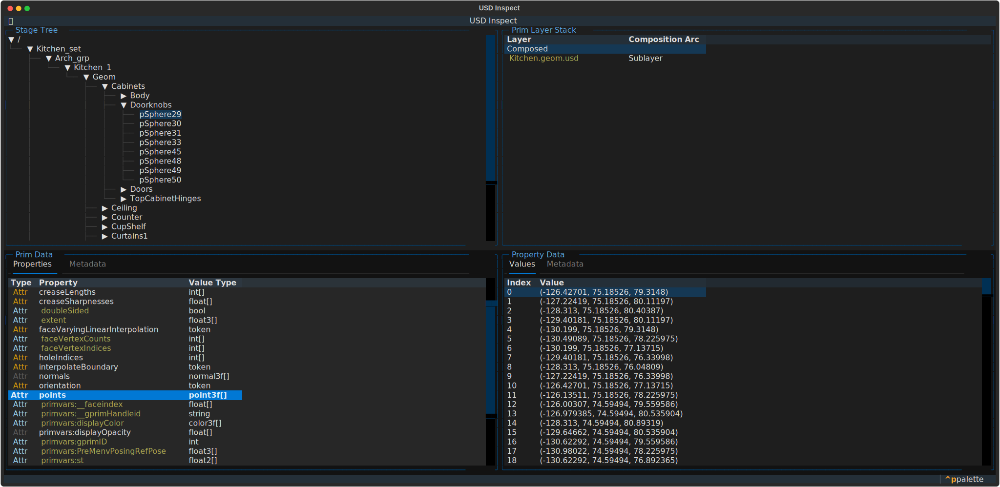

# Usd Inspect



**usdinspect** is a command-line interface (CLI) tool designed to replicate and expand on the inspection functionality of **usdview** using **Textual**, a Python library for creating terminal-based user interfaces. This tool allows users to explore USD (Universal Scene Description) files, providing a lightweight, accessible experience with a focus on terminal usage.

> [!WARNING]  
> This project is in active development. Expect frequent breaking changes.

## Features

- Navigate and inspect USD file structure directly in the terminal.
- View detailed information on prims, properties, and metadata.
- Inspect property values at any frame using an interactive timeline widget.
- Visually identify what Layer authors a Property via color tagging. Each Property is highlighted by a unique color that represents the Layer that has the strongest opinion on it.


## Why use this over usdview?

This project is not intended to be a direct replacement to `usdview` as it has no imaging capabilities, instead it aims to provide an alternative and more streamlined way of inspecting the objects that make up a USD Stage and their relationships to each other through a terminal-based interface. It started as an experiment to explore **Textual** but it has slowly evolved into a small toolset that is effective for performing basic inspection of a USD Stage, I hope that it continues to mature and explore new ideas for interacting with USD data.


## What's missing?

- [ ] Prim Metadata-Layer color tagging.
- [ ] Property Metadata-Layer color tagging.
- And a lot more...


## Requirements

- Python==3.10


## Installation & Usage

```bash
git clone https://github.com/JaimeFlorian27/usdinspect.git`
cd usdinspect
pip install .
usdinspect <usd_file>
```


## Contributing

TBD...
